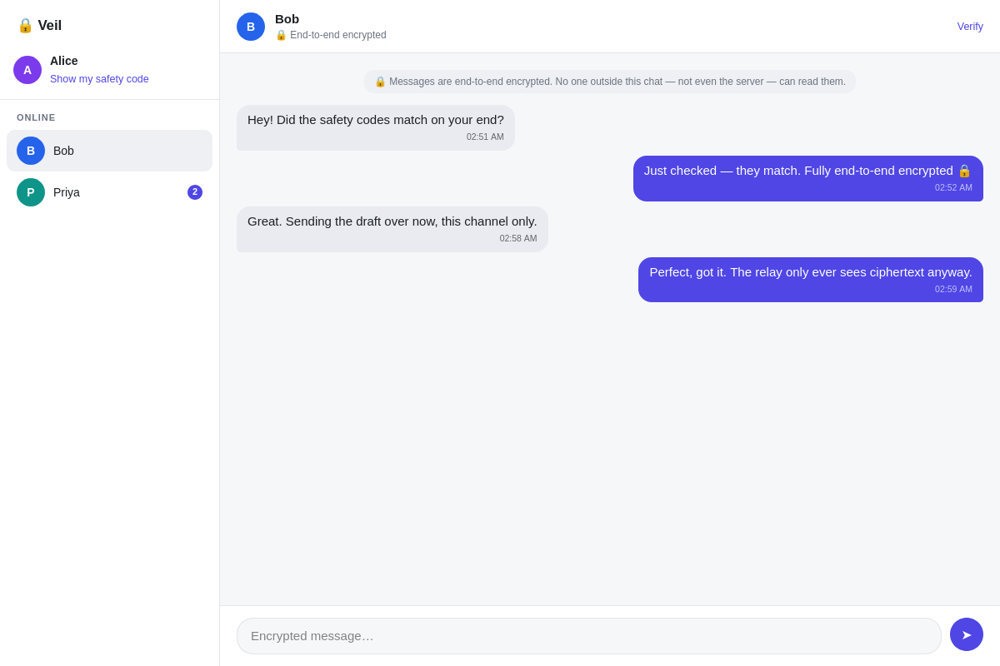

# 🔒 Veil

Minimal, open-source, end-to-end encrypted messaging.

A zero-dependency Python relay server plus a single-page web client. All
encryption happens on your device with the browser's built-in WebCrypto API —
the server only ever relays ciphertext and cannot read any message.



## Try it

A public test instance runs at: **_(deploy in progress — URL coming shortly)_**

No install, no account — open the link, pick a display name, and send the
invite link (button in the sidebar) to someone you want to chat with. The
free-tier instance sleeps when idle, so the first load can take up to a
minute. Everyone on the same instance appears in each other's roster;
message contents stay end-to-end encrypted regardless.

Want your own instance? One click:
[](https://render.com/deploy?repo=https://github.com/pyamin1878/veil)

## Quick start

```sh
python3 server.py            # http://localhost:8420  (or: python3 server.py <port>)
```

That's it — no build step, no packages to install. Open the URL in any modern
browser, pick a display name, and everyone connected to the same server can
message each other privately.

**Cross-platform:** the client runs in any modern browser on Linux, macOS,
Windows, Android and iOS; the server runs anywhere Python 3.8+ runs (including
a Raspberry Pi). Because the client is three static files with no framework,
it can also be wrapped in Tauri or Electron for a native desktop app.

## How the encryption works

| Step | Mechanism |
|---|---|
| Identity | ECDH keypair on P-256, generated on-device via WebCrypto. The private key is **non-extractable** — it is persisted as a `CryptoKey` in IndexedDB and its bytes can never be read out by script, not even by the app itself. |
| Key agreement | ECDH between your private key and the peer's public key |
| Key derivation | HKDF-SHA256 (salt = both public keys in canonical order, info = `veil-conversation-v1`) → per-conversation AES-256-GCM key |
| Messages | AES-GCM with a fresh random 96-bit IV per message; tampering causes decryption to fail loudly |
| Verification | Each identity has a **safety code** (SHA-256 fingerprint of the public key). Compare codes out-of-band — in person or on a call — to rule out a man-in-the-middle. |

The server (`server.py`, ~250 lines, stdlib only) holds everything in memory,
writes nothing to disk, and sees only: display names, public keys, and opaque
`{iv, ct}` blobs.

## Testing

The crypto module is pure WebCrypto and runs unchanged under Node, so the
tests exercise the exact code the browser executes:

```sh
node --test test/     # needs Node >= 19 (tests only; the app itself needs no Node)
```

The suite covers key agreement symmetry, ciphertext freshness, tamper
rejection, third-party decryption failure, fingerprint stability — and a full
end-to-end run that boots the real Python server, joins two clients, and
asserts the relayed wire bytes never contain plaintext.

## Honest limitations

This is a small, auditable design — not a Signal replacement. Know what you
are (and aren't) getting:

- **No forward secrecy / post-compromise security.** One long-lived key per
  conversation, no Double Ratchet. If a device's key is compromised, past
  messages that an attacker recorded off the wire could be decrypted.
- **Trust-on-first-use.** The server hands out public keys. A malicious server
  could substitute its own key (MITM) — that's exactly what comparing safety
  codes out-of-band detects. Verify codes with anyone you need real
  confidentiality with.
- **Run it behind HTTPS in production.** E2EE protects message content even
  over plain HTTP, but TLS (e.g. a Caddy/nginx reverse proxy) protects
  metadata, tokens, and the integrity of the delivered JavaScript itself.
- **Metadata is visible to the server:** who is online, who messages whom,
  when, and how much. Content is not.
- **Ephemeral by design.** Messages exist only in the memory of the two
  devices in the conversation; there is no server-side history, and reloading
  the page clears local history.
- 1:1 chats only; no groups, attachments, or multi-device sync (yet).

## Project layout

```
server.py          blind ciphertext relay + static file server (Python stdlib)
client/
  index.html       UI shell
  style.css        theme-aware styling (light/dark), no external assets
  app.js           UI logic, identity storage, transport
  crypto.js        all cryptography — pure functions, browser & Node
test/
  e2e.test.mjs     crypto unit tests + full client↔server↔client flow
```

## License

MIT — see [LICENSE](LICENSE).
